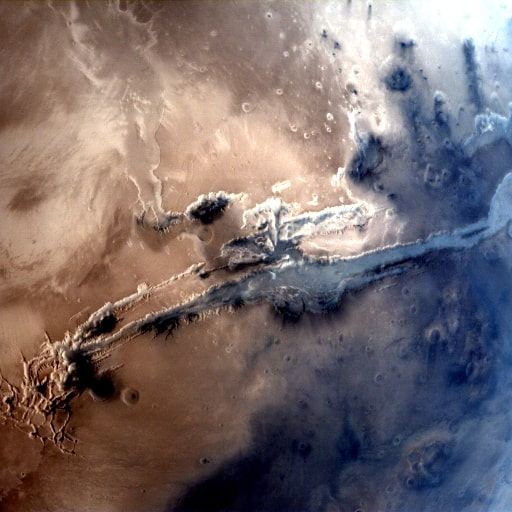
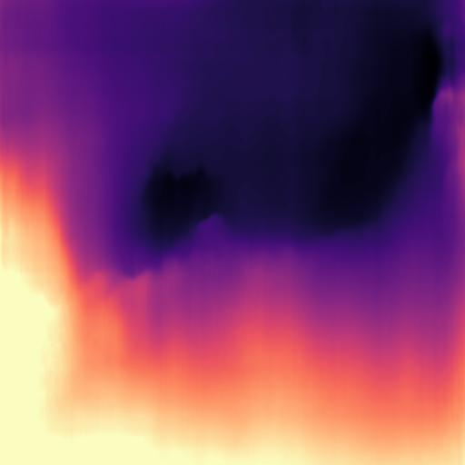

# NM392_SATTVA

Organization name: ISRO
Team Name : SATTVA

## Problem Description
Problem Statement : Depth Estimation of Valles Marineris using ISRO’s Mars Color Camera (MCC) images.
Problem Code: NM392
The idea is to create a Depth Estimation System that uses multiple techniques to estimate the depth of Valles Marineris based on an input set of MCC images.

## Initial Solution
CNN and Pose Estimation were used initially for estimating depth the model that was used was pre trained on KITTI dataset for monocular depth prediction.
|INPUT     |OUTPUT|
:-------------------------:|:-------------------------:
 | 
 | 

## Proposed System Architecture

