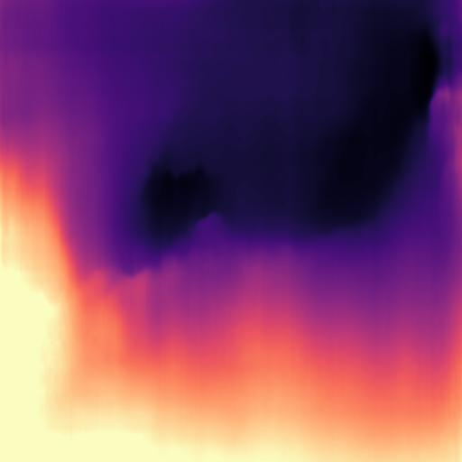
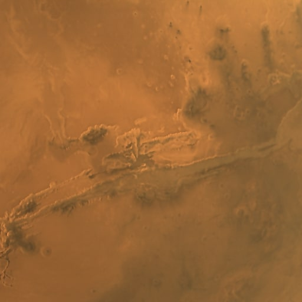
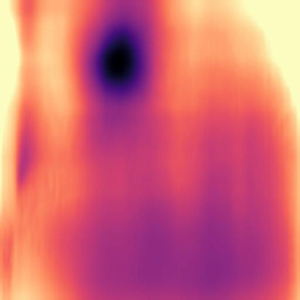
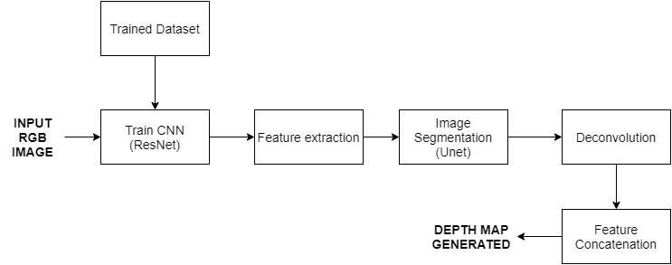
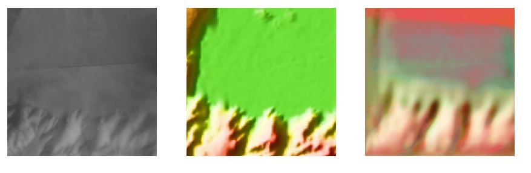
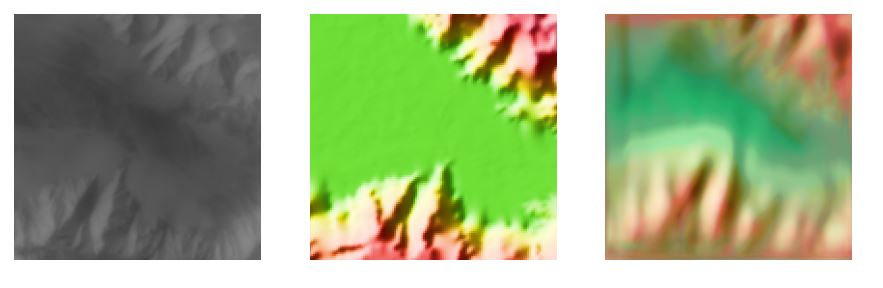
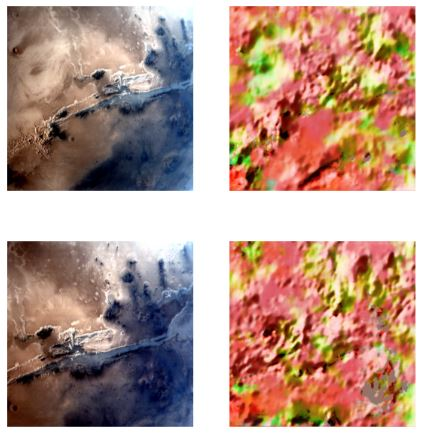

# NM392_SATTVA

Organization name: ISRO\
Team Name : SATTVA

## Problem Description
Problem Statement : Depth Estimation of Valles Marineris using ISRO’s Mars Color Camera (MCC) images.\
Problem Code: NM392\
The idea is to create a Depth Estimation System that uses multiple techniques to estimate the depth of Valles Marineris based on an input set of MCC images.

## Initial Solution
CNN and Pose Estimation were used initially for estimating depth the model that was used was pre trained on KITTI dataset for monocular depth prediction.
|INPUT     |OUTPUT|
:-------------------------:|:-------------------------:
 | 
 | 

## Final Solution
ResNet and Unet were used to arrive at the final solution and the model was trained using the data collected by nasas missions.The dataset that was used consisted of the images of the martian surface and the corresponding depth map which belonged to NASAs MOLA mission the collected data was augmented thus the dataset comprises of 1770 images.

### Proposed System Architecture

### Parameters

### OUTPUT
Test(MOLA dataset):

\

MCC images:\

